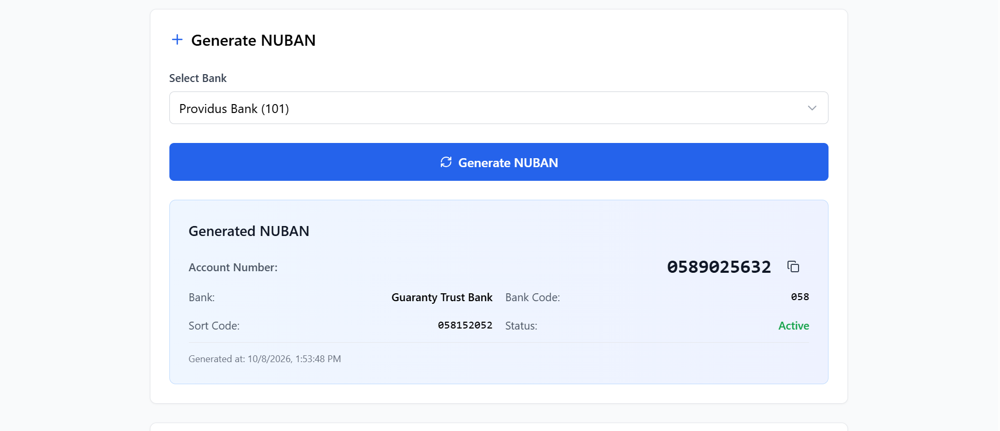

# NUBAN Manager

A React + TypeScript app for generating, validating, and tracking Nigerian NUBAN account numbers. It uses a mock API, so no backend is needed.

**Live demo:** https://numban-generator-mi2a.vercel.app/


<!-- Add 1-2 screenshots (or a short GIF) in /docs. Mobile view is worth showing too. -->

## Why I built this

Account number validation is a core piece of Nigerian payment flows. I built this to practise the kind of problems I deal with in banking UIs: check-digit logic, async state, form feedback, and keeping a feature-first codebase tidy as it grows.

## Features

- **Generate** a NUBAN for a selected bank code, with the check digit calculated for you.
- **Validate** any 10-digit NUBAN against a bank code and get instant pass/fail feedback.
- **History** of validated numbers with status, filtering by bank code, and sorting.
- **Global UI state** for loading, error, and success feedback.
- **Optional persistence** to localStorage so history survives a refresh.
- **Responsive** layout for desktop and mobile.

## Tech stack

React, TypeScript, Vite, Redux Toolkit (RTK Query), Tailwind CSS, Headless UI, Lucide Icons, date-fns, @faker-js/faker (mock data).

## Technical decisions

- **Feature-first structure** (`features/nuban`, `validation`, `filters`, `ui`) so each feature owns its slice, components, and types.
- **RTK Query against a mock API service** that simulates latency and errors, so loading and error states are exercised for real.
- **Custom middleware** for persisting selected state to localStorage (can be disabled in `src/app/store.ts`).

## Getting started

```bash
git clone https://github.com/Echuemma/numban-generator.git
cd numban-generator
npm install
npm run dev
```

Open http://localhost:5173.

To build for production:

```bash
npm run build
```

## Project structure

```
src/
  app/            # Redux store & middleware
  features/       # Feature modules (nuban, validation, filters, ui)
  shared/         # Shared components, hooks, services, types, utils
  styles/         # Tailwind CSS
  App.tsx         # Main app
  main.tsx        # Entry point
```

## Notes and limitations

- This is a demo. All data comes from a mock API; there is no real authentication or bank integration.
- The check-digit logic follows the standard NUBAN scheme. Bank codes in `src/shared/utils/constants.ts` are a sample set, not a complete or guaranteed-current list, so don't use this to validate real accounts.
- Optimised for modern browsers.

## License

MIT

## Contact

Echu Emmanuel Ogar, echuemmanuel918@gmail.com